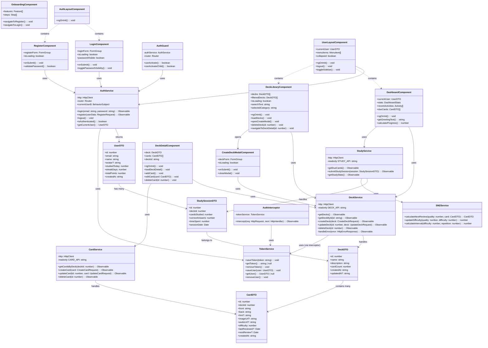

# CLASS DIAGRAM - HỆ THỐNG SMART FLASHCARD

## Frontend Architecture Class Diagram



## Backend API Class Structure (cho tham khảo)

```mermaid
classDiagram
    %% =================== ENTITIES ===================
    class User {
        +id: number
        +email: string
        +password: string (hashed)
        +name: string
        +avatar?: string
        +studiedToday: number
        +streakDays: number
        +totalPoints: number
        +createdAt: Date
        +updatedAt: Date
    }

    class Deck {
        +id: number
        +userId: number
        +name: string
        +description: string
        +cardCount: number
        +createdAt: Date
        +updatedAt: Date
    }

    class Card {
        +id: number
        +deckId: number
        +front: string
        +back: string
        +hint?: string
        +imageUrl?: string
        +audioUrl?: string
        +difficulty: number
        +repetition: number
        +easinessFactor: number
        +lastReviewed?: Date
        +nextReview?: Date
        +createdAt: Date
        +updatedAt: Date
    }

    class StudySession {
        +id: number
        +userId: number
        +deckId: number
        +cardsStudied: number
        +correctAnswers: number
        +timeSpent: number
        +sessionDate: Date
        +createdAt: Date
    }

    %% =================== CONTROLLERS ===================
    class AuthController {
        +login(LoginRequest): LoginResponse
        +register(RegisterRequest): RegisterResponse
        +refresh(RefreshRequest): TokenResponse
        +logout(): void
    }

    class DeckController {
        +getDecks(userId: number): DeckDTO[]
        +getDeckById(id: number): DeckDTO
        +createDeck(CreateDeckRequest): DeckDTO
        +updateDeck(id: number, UpdateDeckRequest): DeckDTO
        +deleteDeck(id: number): void
    }

    class CardController {
        +getCardsByDeck(deckId: number): CardDTO[]
        +createCard(CreateCardRequest): CardDTO
        +updateCard(id: number, UpdateCardRequest): CardDTO
        +deleteCard(id: number): void
    }

    %% =================== SERVICES ===================
    class AuthService_BE {
        +authenticate(email: string, password: string): User
        +generateTokens(user: User): TokenPair
        +validateToken(token: string): boolean
    }

    class DeckService_BE {
        +findByUserId(userId: number): Deck[]
        +create(deck: Deck): Deck
        +update(id: number, deck: Partial<Deck>): Deck
        +delete(id: number): void
    }

    class SM2Algorithm {
        +calculateNextReview(quality: number, card: Card): Card
        +updateEasinessFactor(quality: number, easiness: number): number
    }

    %% =================== RELATIONSHIPS ===================
    User ||--o{ Deck : owns
    Deck ||--o{ Card : contains
    User ||--o{ StudySession : has
    StudySession }o--|| Deck : studies

    AuthController --> AuthService_BE : uses
    DeckController --> DeckService_BE : uses
    CardController --> SM2Algorithm : uses
```

## Architectural Patterns Used:

### 1. **MVC Pattern (Frontend)**
- **Model**: DTOs (DeckDTO, CardDTO, UserDTO)
- **View**: Components (.html templates)
- **Controller**: Component classes (.ts files)

### 2. **Service Layer Pattern**
- **Presentation Layer**: Components
- **Business Logic Layer**: Services (AuthService, DeckService)
- **Data Access Layer**: HTTP Client + Backend API

### 3. **Observer Pattern**
- **Subject**: BehaviorSubject trong AuthService
- **Observers**: Components subscribe để nhận state changes

### 4. **Dependency Injection**
- Angular DI container quản lý lifecycle của services
- Constructor injection cho service dependencies

### 5. **Interceptor Pattern**
- AuthInterceptor tự động thêm JWT token vào HTTP requests

### Notes cho Demo:

#### Điểm mạnh Architecture:
1. **Separation of Concerns**: Rõ ràng giữa UI, Business Logic, và Data
2. **Scalability**: Dễ mở rộng thêm features
3. **Testability**: Services có thể unit test độc lập
4. **Maintainability**: Code organization theo Angular best practices
5. **Type Safety**: TypeScript với interfaces rõ ràng