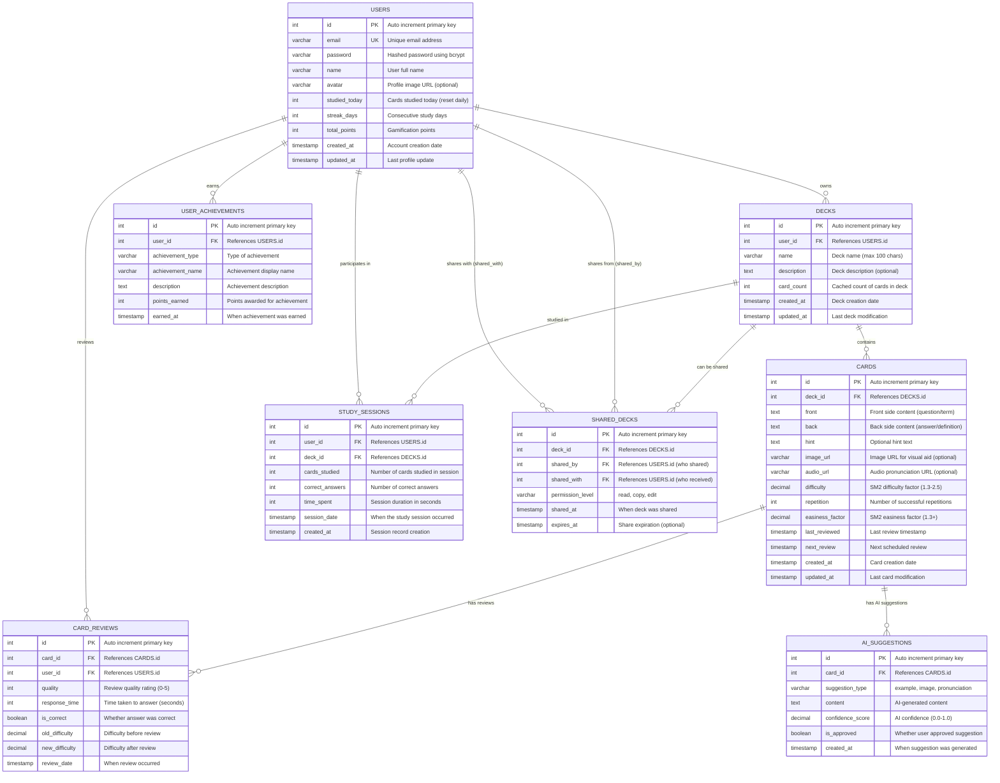

# DATABASE SCHEMA & ERD - SMART FLASHCARD SYSTEM

## Entity Relationship Diagram (ERD)



## Database Schema SQL

```sql
-- =================== USERS TABLE ===================
CREATE TABLE users (
    id INT AUTO_INCREMENT PRIMARY KEY,
    email VARCHAR(255) NOT NULL UNIQUE,
    password VARCHAR(255) NOT NULL, -- bcrypt hashed
    name VARCHAR(100) NOT NULL,
    avatar VARCHAR(500) NULL,
    studied_today INT DEFAULT 0,
    streak_days INT DEFAULT 0,
    total_points INT DEFAULT 0,
    created_at TIMESTAMP DEFAULT CURRENT_TIMESTAMP,
    updated_at TIMESTAMP DEFAULT CURRENT_TIMESTAMP ON UPDATE CURRENT_TIMESTAMP,
    
    INDEX idx_email (email),
    INDEX idx_streak (streak_days DESC),
    INDEX idx_points (total_points DESC)
);

-- =================== DECKS TABLE ===================
CREATE TABLE decks (
    id INT AUTO_INCREMENT PRIMARY KEY,
    user_id INT NOT NULL,
    name VARCHAR(100) NOT NULL,
    description TEXT NULL,
    card_count INT DEFAULT 0,
    created_at TIMESTAMP DEFAULT CURRENT_TIMESTAMP,
    updated_at TIMESTAMP DEFAULT CURRENT_TIMESTAMP ON UPDATE CURRENT_TIMESTAMP,
    
    FOREIGN KEY (user_id) REFERENCES users(id) ON DELETE CASCADE,
    INDEX idx_user_decks (user_id, created_at DESC),
    INDEX idx_deck_name (name)
);

-- =================== CARDS TABLE ===================
CREATE TABLE cards (
    id INT AUTO_INCREMENT PRIMARY KEY,
    deck_id INT NOT NULL,
    front TEXT NOT NULL,
    back TEXT NOT NULL,
    hint TEXT NULL,
    image_url VARCHAR(500) NULL,
    audio_url VARCHAR(500) NULL,
    difficulty DECIMAL(3,2) DEFAULT 2.50, -- SM2 difficulty factor
    repetition INT DEFAULT 0,
    easiness_factor DECIMAL(3,2) DEFAULT 2.50, -- SM2 easiness factor
    last_reviewed TIMESTAMP NULL,
    next_review TIMESTAMP NULL,
    created_at TIMESTAMP DEFAULT CURRENT_TIMESTAMP,
    updated_at TIMESTAMP DEFAULT CURRENT_TIMESTAMP ON UPDATE CURRENT_TIMESTAMP,
    
    FOREIGN KEY (deck_id) REFERENCES decks(id) ON DELETE CASCADE,
    INDEX idx_deck_cards (deck_id, created_at),
    INDEX idx_due_cards (next_review, deck_id),
    INDEX idx_difficulty (difficulty)
);

-- =================== STUDY_SESSIONS TABLE ===================
CREATE TABLE study_sessions (
    id INT AUTO_INCREMENT PRIMARY KEY,
    user_id INT NOT NULL,
    deck_id INT NOT NULL,
    cards_studied INT NOT NULL,
    correct_answers INT NOT NULL,
    time_spent INT NOT NULL, -- in seconds
    session_date TIMESTAMP DEFAULT CURRENT_TIMESTAMP,
    created_at TIMESTAMP DEFAULT CURRENT_TIMESTAMP,
    
    FOREIGN KEY (user_id) REFERENCES users(id) ON DELETE CASCADE,
    FOREIGN KEY (deck_id) REFERENCES decks(id) ON DELETE CASCADE,
    INDEX idx_user_sessions (user_id, session_date DESC),
    INDEX idx_deck_sessions (deck_id, session_date DESC)
);

-- =================== CARD_REVIEWS TABLE ===================
CREATE TABLE card_reviews (
    id INT AUTO_INCREMENT PRIMARY KEY,
    card_id INT NOT NULL,
    user_id INT NOT NULL,
    quality INT NOT NULL CHECK (quality BETWEEN 0 AND 5), -- SM2 quality rating
    response_time INT NOT NULL, -- in seconds
    is_correct BOOLEAN NOT NULL,
    old_difficulty DECIMAL(3,2) NOT NULL,
    new_difficulty DECIMAL(3,2) NOT NULL,
    review_date TIMESTAMP DEFAULT CURRENT_TIMESTAMP,
    
    FOREIGN KEY (card_id) REFERENCES cards(id) ON DELETE CASCADE,
    FOREIGN KEY (user_id) REFERENCES users(id) ON DELETE CASCADE,
    INDEX idx_card_reviews (card_id, review_date DESC),
    INDEX idx_user_reviews (user_id, review_date DESC),
    INDEX idx_quality_analysis (quality, is_correct)
);

-- =================== USER_ACHIEVEMENTS TABLE ===================
CREATE TABLE user_achievements (
    id INT AUTO_INCREMENT PRIMARY KEY,
    user_id INT NOT NULL,
    achievement_type VARCHAR(50) NOT NULL, -- 'streak', 'cards_studied', 'perfect_session', etc.
    achievement_name VARCHAR(100) NOT NULL,
    description TEXT NOT NULL,
    points_earned INT NOT NULL,
    earned_at TIMESTAMP DEFAULT CURRENT_TIMESTAMP,
    
    FOREIGN KEY (user_id) REFERENCES users(id) ON DELETE CASCADE,
    UNIQUE KEY unique_user_achievement (user_id, achievement_type, achievement_name),
    INDEX idx_user_achievements (user_id, earned_at DESC),
    INDEX idx_achievement_type (achievement_type)
);

-- =================== SHARED_DECKS TABLE ===================
CREATE TABLE shared_decks (
    id INT AUTO_INCREMENT PRIMARY KEY,
    deck_id INT NOT NULL,
    shared_by INT NOT NULL,
    shared_with INT NOT NULL,
    permission_level ENUM('read', 'copy', 'edit') DEFAULT 'read',
    shared_at TIMESTAMP DEFAULT CURRENT_TIMESTAMP,
    expires_at TIMESTAMP NULL,
    
    FOREIGN KEY (deck_id) REFERENCES decks(id) ON DELETE CASCADE,
    FOREIGN KEY (shared_by) REFERENCES users(id) ON DELETE CASCADE,
    FOREIGN KEY (shared_with) REFERENCES users(id) ON DELETE CASCADE,
    UNIQUE KEY unique_share (deck_id, shared_by, shared_with),
    INDEX idx_shared_with (shared_with, shared_at DESC),
    INDEX idx_shared_by (shared_by, shared_at DESC)
);

-- =================== AI_SUGGESTIONS TABLE ===================
CREATE TABLE ai_suggestions (
    id INT AUTO_INCREMENT PRIMARY KEY,
    card_id INT NOT NULL,
    suggestion_type ENUM('example', 'image', 'pronunciation', 'context') NOT NULL,
    content TEXT NOT NULL,
    confidence_score DECIMAL(3,2) NOT NULL CHECK (confidence_score BETWEEN 0.00 AND 1.00),
    is_approved BOOLEAN DEFAULT FALSE,
    created_at TIMESTAMP DEFAULT CURRENT_TIMESTAMP,
    
    FOREIGN KEY (card_id) REFERENCES cards(id) ON DELETE CASCADE,
    INDEX idx_card_suggestions (card_id, suggestion_type),
    INDEX idx_approved_suggestions (is_approved, confidence_score DESC),
    INDEX idx_suggestion_type (suggestion_type)
);

-- =================== TRIGGERS FOR AUTOMATIC UPDATES ===================

-- Trigger to update deck card_count when cards are added/removed
DELIMITER //
CREATE TRIGGER update_deck_card_count_insert
    AFTER INSERT ON cards
    FOR EACH ROW
BEGIN
    UPDATE decks 
    SET card_count = card_count + 1,
        updated_at = CURRENT_TIMESTAMP
    WHERE id = NEW.deck_id;
END//

CREATE TRIGGER update_deck_card_count_delete
    AFTER DELETE ON cards
    FOR EACH ROW
BEGIN
    UPDATE decks 
    SET card_count = card_count - 1,
        updated_at = CURRENT_TIMESTAMP
    WHERE id = OLD.deck_id;
END//

-- Trigger to reset studied_today daily (would be handled by cron job in real implementation)
CREATE EVENT reset_daily_stats
ON SCHEDULE EVERY 1 DAY
STARTS '2024-01-01 00:00:00'
DO
    UPDATE users SET studied_today = 0;//

DELIMITER ;

-- =================== SAMPLE DATA FOR DEMO ===================

INSERT INTO users (email, password, name, studied_today, streak_days, total_points) VALUES
('kien@example.com', '$2a$10$92IXUNpkjO0rOQ5byMi.Ye4oKoEa3Ro9llC/.og/at2.uheWG/igi', 'Kiên Gabby', 15, 7, 2500),
('demo@example.com', '$2a$10$92IXUNpkjO0rOQ5byMi.Ye4oKoEa3Ro9llC/.og/at2.uheWG/igi', 'Demo User', 8, 3, 1200);

INSERT INTO decks (user_id, name, description, card_count) VALUES
(1, 'Từ vựng tiếng Anh cơ bản', 'Tổng hợp 500 từ vựng tiếng Anh thông dụng nhất cho người mới bắt đầu', 8),
(1, 'Ngữ pháp tiếng Anh', 'Các cấu trúc ngữ pháp quan trọng trong tiếng Anh', 3),
(2, 'IELTS Vocabulary', 'Essential vocabulary for IELTS exam preparation', 12);

INSERT INTO cards (deck_id, front, back, hint, difficulty, repetition, easiness_factor, next_review) VALUES
(1, 'Hello', 'Xin chào', 'Greeting word', 2.5, 0, 2.5, DATE_ADD(NOW(), INTERVAL 1 DAY)),
(1, 'Beautiful', 'Đẹp, xinh đẹp', 'Adjective for appearance', 2.3, 1, 2.4, DATE_ADD(NOW(), INTERVAL 3 DAY)),
(1, 'Important', 'Quan trọng', 'Adjective for significance', 2.6, 2, 2.6, DATE_ADD(NOW(), INTERVAL 7 DAY));
```

## Database Indexes Strategy

### Performance Optimization Indexes:

1. **User Lookups**: 
   - `idx_email` for authentication
   - `idx_streak` and `idx_points` for leaderboards

2. **Deck Operations**:
   - `idx_user_decks` for user's deck listing
   - `idx_deck_name` for deck search

3. **Card Management**:
   - `idx_deck_cards` for loading deck contents
   - `idx_due_cards` for spaced repetition scheduling
   - `idx_difficulty` for adaptive learning

4. **Study Analytics**:
   - `idx_user_sessions` for user progress tracking
   - `idx_card_reviews` for card performance analysis

## Migration Scripts cho Development

```sql
-- Development migration script
-- Run this to set up the database for demo

-- 1. Create database
CREATE DATABASE smart_flashcard_db CHARACTER SET utf8mb4 COLLATE utf8mb4_unicode_ci;
USE smart_flashcard_db;

-- 2. Run all CREATE TABLE statements above

-- 3. Insert sample data for demo

-- 4. Create indexes for performance

-- 5. Set up triggers for automatic updates
```

## Notes cho Demo Presentation:

### Database Design Highlights:

1. **Normalization**: 3NF compliance với proper foreign keys
2. **Performance**: Strategic indexing cho common queries
3. **Scalability**: Auto-increment PKs, proper data types
4. **Data Integrity**: Constraints, triggers, cascading deletes
5. **Analytics Ready**: Separate review tracking for ML insights
6. **Gamification Support**: Points, achievements, streak tracking
7. **AI Integration**: Suggestion storage với confidence scoring
8. **Social Features**: Deck sharing với permission levels

### Technical Implementation Notes:

- **Backend**: Spring Boot với JPA/Hibernate
- **Database**: MySQL 8.0+ với InnoDB engine
- **Caching**: Redis cho session management
- **File Storage**: AWS S3 cho images/audio
- **Search**: Elasticsearch cho advanced deck search
- **Analytics**: Separate analytics database cho reporting