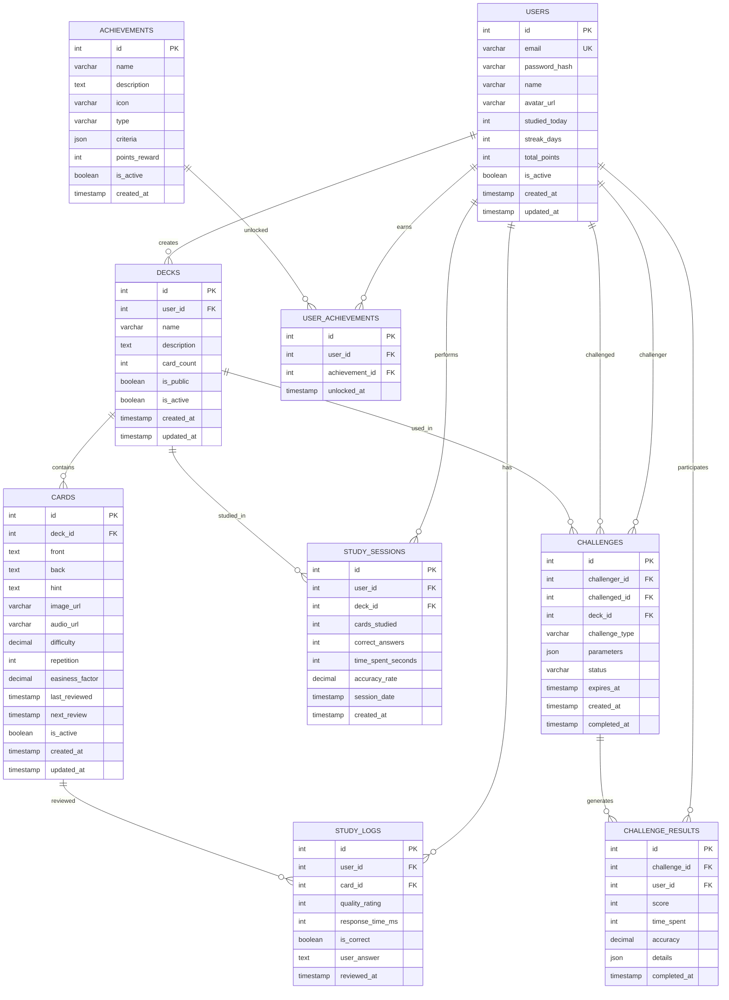

# DATABASE SCHEMA - SMART FLASHCARD SYSTEM

## Entity Relationship Diagram (ERD)



## Database Tables Specification

### 1. USERS Table
```sql
CREATE TABLE users (
    id SERIAL PRIMARY KEY,
    email VARCHAR(255) UNIQUE NOT NULL,
    password_hash VARCHAR(255) NOT NULL,
    name VARCHAR(100) NOT NULL,
    avatar_url VARCHAR(500),
    studied_today INTEGER DEFAULT 0,
    streak_days INTEGER DEFAULT 0,
    total_points INTEGER DEFAULT 0,
    is_active BOOLEAN DEFAULT true,
    created_at TIMESTAMP DEFAULT CURRENT_TIMESTAMP,
    updated_at TIMESTAMP DEFAULT CURRENT_TIMESTAMP ON UPDATE CURRENT_TIMESTAMP,
    
    INDEX idx_email (email),
    INDEX idx_active (is_active)
);
```

### 2. DECKS Table
```sql
CREATE TABLE decks (
    id SERIAL PRIMARY KEY,
    user_id INTEGER NOT NULL,
    name VARCHAR(200) NOT NULL,
    description TEXT,
    card_count INTEGER DEFAULT 0,
    is_public BOOLEAN DEFAULT false,
    is_active BOOLEAN DEFAULT true,
    created_at TIMESTAMP DEFAULT CURRENT_TIMESTAMP,
    updated_at TIMESTAMP DEFAULT CURRENT_TIMESTAMP ON UPDATE CURRENT_TIMESTAMP,
    
    FOREIGN KEY (user_id) REFERENCES users(id) ON DELETE CASCADE,
    INDEX idx_user_id (user_id),
    INDEX idx_active (is_active),
    INDEX idx_created_at (created_at)
);
```

### 3. CARDS Table
```sql
CREATE TABLE cards (
    id SERIAL PRIMARY KEY,
    deck_id INTEGER NOT NULL,
    front TEXT NOT NULL,
    back TEXT NOT NULL,
    hint TEXT,
    image_url VARCHAR(500),
    audio_url VARCHAR(500),
    difficulty DECIMAL(3,2) DEFAULT 2.50,
    repetition INTEGER DEFAULT 0,
    easiness_factor DECIMAL(3,2) DEFAULT 2.50,
    last_reviewed TIMESTAMP NULL,
    next_review TIMESTAMP NULL,
    is_active BOOLEAN DEFAULT true,
    created_at TIMESTAMP DEFAULT CURRENT_TIMESTAMP,
    updated_at TIMESTAMP DEFAULT CURRENT_TIMESTAMP ON UPDATE CURRENT_TIMESTAMP,
    
    FOREIGN KEY (deck_id) REFERENCES decks(id) ON DELETE CASCADE,
    INDEX idx_deck_id (deck_id),
    INDEX idx_next_review (next_review),
    INDEX idx_active (is_active)
);
```

### 4. STUDY_SESSIONS Table
```sql
CREATE TABLE study_sessions (
    id SERIAL PRIMARY KEY,
    user_id INTEGER NOT NULL,
    deck_id INTEGER NOT NULL,
    cards_studied INTEGER NOT NULL,
    correct_answers INTEGER NOT NULL,
    time_spent_seconds INTEGER NOT NULL,
    accuracy_rate DECIMAL(5,2) GENERATED ALWAYS AS (
        CASE 
            WHEN cards_studied > 0 THEN (correct_answers * 100.0 / cards_studied)
            ELSE 0 
        END
    ) STORED,
    session_date DATE NOT NULL,
    created_at TIMESTAMP DEFAULT CURRENT_TIMESTAMP,
    
    FOREIGN KEY (user_id) REFERENCES users(id) ON DELETE CASCADE,
    FOREIGN KEY (deck_id) REFERENCES decks(id) ON DELETE CASCADE,
    INDEX idx_user_id (user_id),
    INDEX idx_session_date (session_date),
    INDEX idx_created_at (created_at)
);
```

### 5. STUDY_LOGS Table
```sql
CREATE TABLE study_logs (
    id SERIAL PRIMARY KEY,
    user_id INTEGER NOT NULL,
    card_id INTEGER NOT NULL,
    quality_rating INTEGER NOT NULL CHECK (quality_rating BETWEEN 0 AND 5),
    response_time_ms INTEGER NOT NULL,
    is_correct BOOLEAN NOT NULL,
    user_answer TEXT,
    reviewed_at TIMESTAMP DEFAULT CURRENT_TIMESTAMP,
    
    FOREIGN KEY (user_id) REFERENCES users(id) ON DELETE CASCADE,
    FOREIGN KEY (card_id) REFERENCES cards(id) ON DELETE CASCADE,
    INDEX idx_user_id (user_id),
    INDEX idx_card_id (card_id),
    INDEX idx_reviewed_at (reviewed_at)
);
```

### 6. ACHIEVEMENTS Table
```sql
CREATE TABLE achievements (
    id SERIAL PRIMARY KEY,
    name VARCHAR(100) NOT NULL,
    description TEXT NOT NULL,
    icon VARCHAR(50) NOT NULL,
    type ENUM('study_streak', 'cards_learned', 'accuracy', 'speed', 'social') NOT NULL,
    criteria JSON NOT NULL,
    points_reward INTEGER DEFAULT 0,
    is_active BOOLEAN DEFAULT true,
    created_at TIMESTAMP DEFAULT CURRENT_TIMESTAMP,
    
    INDEX idx_type (type),
    INDEX idx_active (is_active)
);
```

### 7. USER_ACHIEVEMENTS Table
```sql
CREATE TABLE user_achievements (
    id SERIAL PRIMARY KEY,
    user_id INTEGER NOT NULL,
    achievement_id INTEGER NOT NULL,
    unlocked_at TIMESTAMP DEFAULT CURRENT_TIMESTAMP,
    
    FOREIGN KEY (user_id) REFERENCES users(id) ON DELETE CASCADE,
    FOREIGN KEY (achievement_id) REFERENCES achievements(id) ON DELETE CASCADE,
    UNIQUE KEY unique_user_achievement (user_id, achievement_id),
    INDEX idx_user_id (user_id),
    INDEX idx_unlocked_at (unlocked_at)
);
```

### 8. CHALLENGES Table
```sql
CREATE TABLE challenges (
    id SERIAL PRIMARY KEY,
    challenger_id INTEGER NOT NULL,
    challenged_id INTEGER NOT NULL,
    deck_id INTEGER NOT NULL,
    challenge_type ENUM('speed', 'accuracy', 'streak', 'vocabulary') NOT NULL,
    parameters JSON NOT NULL,
    status ENUM('pending', 'accepted', 'completed', 'expired', 'declined') DEFAULT 'pending',
    expires_at TIMESTAMP NOT NULL,
    created_at TIMESTAMP DEFAULT CURRENT_TIMESTAMP,
    completed_at TIMESTAMP NULL,
    
    FOREIGN KEY (challenger_id) REFERENCES users(id) ON DELETE CASCADE,
    FOREIGN KEY (challenged_id) REFERENCES users(id) ON DELETE CASCADE,
    FOREIGN KEY (deck_id) REFERENCES decks(id) ON DELETE CASCADE,
    INDEX idx_challenged_id (challenged_id),
    INDEX idx_status (status),
    INDEX idx_expires_at (expires_at)
);
```

### 9. CHALLENGE_RESULTS Table
```sql
CREATE TABLE challenge_results (
    id SERIAL PRIMARY KEY,
    challenge_id INTEGER NOT NULL,
    user_id INTEGER NOT NULL,
    score INTEGER NOT NULL,
    time_spent INTEGER NOT NULL,
    accuracy DECIMAL(5,2) NOT NULL,
    details JSON,
    completed_at TIMESTAMP DEFAULT CURRENT_TIMESTAMP,
    
    FOREIGN KEY (challenge_id) REFERENCES challenges(id) ON DELETE CASCADE,
    FOREIGN KEY (user_id) REFERENCES users(id) ON DELETE CASCADE,
    INDEX idx_challenge_id (challenge_id),
    INDEX idx_user_id (user_id)
);
```

## Database Triggers

### 1. Update card_count in decks table
```sql
DELIMITER //
CREATE TRIGGER update_deck_card_count_after_insert
AFTER INSERT ON cards
FOR EACH ROW
BEGIN
    UPDATE decks 
    SET card_count = (
        SELECT COUNT(*) 
        FROM cards 
        WHERE deck_id = NEW.deck_id AND is_active = true
    )
    WHERE id = NEW.deck_id;
END//

CREATE TRIGGER update_deck_card_count_after_delete
AFTER DELETE ON cards
FOR EACH ROW
BEGIN
    UPDATE decks 
    SET card_count = (
        SELECT COUNT(*) 
        FROM cards 
        WHERE deck_id = OLD.deck_id AND is_active = true
    )
    WHERE id = OLD.deck_id;
END//
DELIMITER ;
```

### 2. Update user stats after study session
```sql
DELIMITER //
CREATE TRIGGER update_user_stats_after_study
AFTER INSERT ON study_sessions
FOR EACH ROW
BEGIN
    -- Update total points
    UPDATE users 
    SET total_points = total_points + NEW.correct_answers * 10
    WHERE id = NEW.user_id;
    
    -- Update study streak (simplified logic)
    UPDATE users 
    SET studied_today = studied_today + NEW.cards_studied
    WHERE id = NEW.user_id;
END//
DELIMITER ;
```

## Indexes for Performance

### Primary Performance Indexes
```sql
-- Users table
CREATE INDEX idx_users_email ON users(email);
CREATE INDEX idx_users_active ON users(is_active);

-- Decks table
CREATE INDEX idx_decks_user_id ON decks(user_id);
CREATE INDEX idx_decks_public ON decks(is_public);
CREATE INDEX idx_decks_created_at ON decks(created_at);

-- Cards table
CREATE INDEX idx_cards_deck_id ON cards(deck_id);
CREATE INDEX idx_cards_next_review ON cards(next_review);
CREATE INDEX idx_cards_difficulty ON cards(difficulty);

-- Study sessions
CREATE INDEX idx_study_sessions_user_date ON study_sessions(user_id, session_date);
CREATE INDEX idx_study_sessions_deck_id ON study_sessions(deck_id);

-- Study logs
CREATE INDEX idx_study_logs_user_card ON study_logs(user_id, card_id);
CREATE INDEX idx_study_logs_reviewed_at ON study_logs(reviewed_at);
```

## Sample Data for Development

### Users
```sql
INSERT INTO users (email, password_hash, name, studied_today, streak_days, total_points) VALUES
('kien@example.com', '$2b$10$hash...', 'Kiên Nguyễn', 15, 7, 1250),
('minh@example.com', '$2b$10$hash...', 'Minh Khoa', 8, 3, 890),
('thu@example.com', '$2b$10$hash...', 'Thu Hà', 22, 12, 2180);
```

### Sample Achievements
```sql
INSERT INTO achievements (name, description, icon, type, criteria, points_reward) VALUES
('First Steps', 'Học 5 thẻ đầu tiên', '🎯', 'cards_learned', '{"cards_required": 5}', 50),
('Week Warrior', 'Học liên tục 7 ngày', '🔥', 'study_streak', '{"days_required": 7}', 100),
('Speed Master', 'Đạt 90% độ chính xác trong 1 phiên', '⚡', 'accuracy', '{"accuracy_required": 90}', 150),
('Vocabulary Beast', 'Học 100 từ vựng', '📚', 'cards_learned', '{"cards_required": 100}', 200);
```

## Notes cho Demo:

### Database Design Highlights:
1. **Scalability**: Proper indexing và normalization
2. **Performance**: Triggers tự động cập nhật thống kê
3. **Integrity**: Foreign keys và constraints đảm bảo data consistency
4. **Flexibility**: JSON fields cho metadata và parameters
5. **Analytics**: Comprehensive logging cho study patterns
6. **Gamification**: Achievement system với flexible criteria

### Technical Features:
- **SM-2 Algorithm Support**: Difficulty, easiness_factor, repetition fields
- **Social Features**: Challenge system với peer-to-peer competition
- **Analytics Ready**: Detailed study logs cho machine learning
- **Audit Trail**: Comprehensive timestamping
- **Soft Deletes**: is_active flags thay vì hard deletes