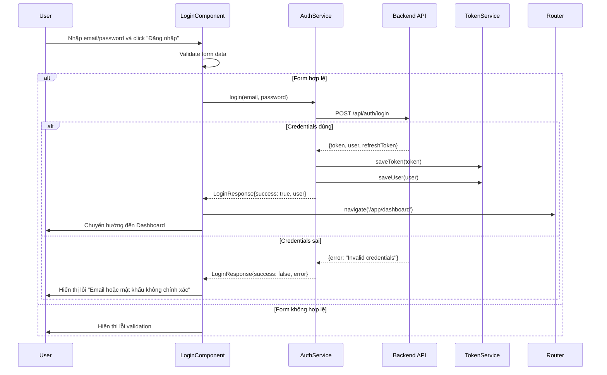
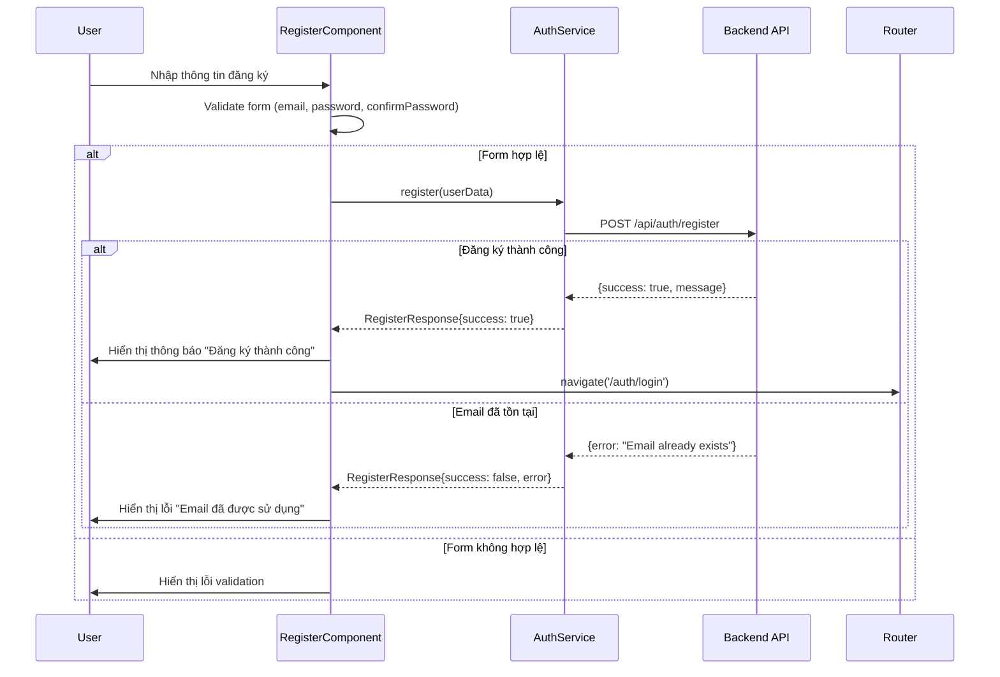
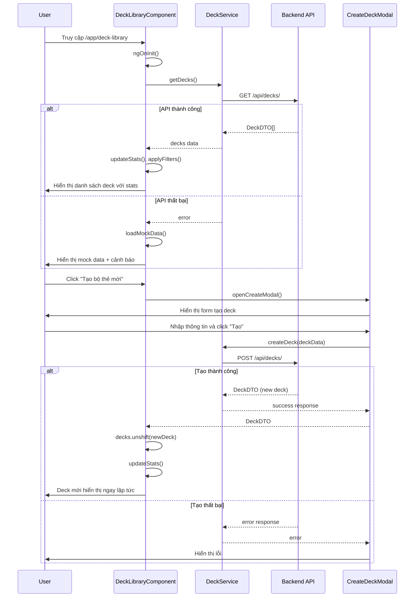
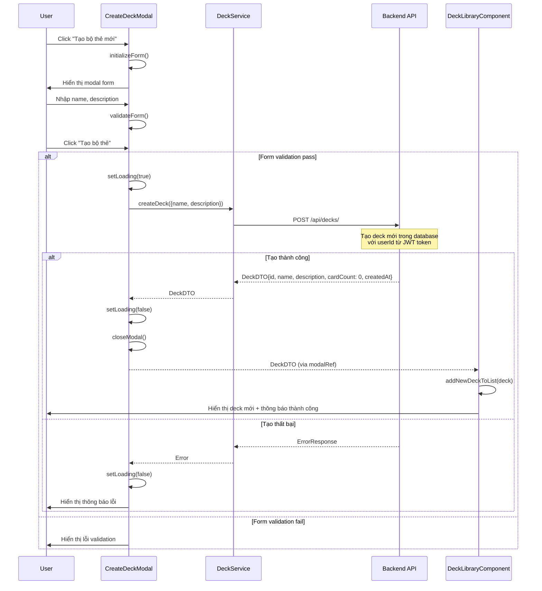
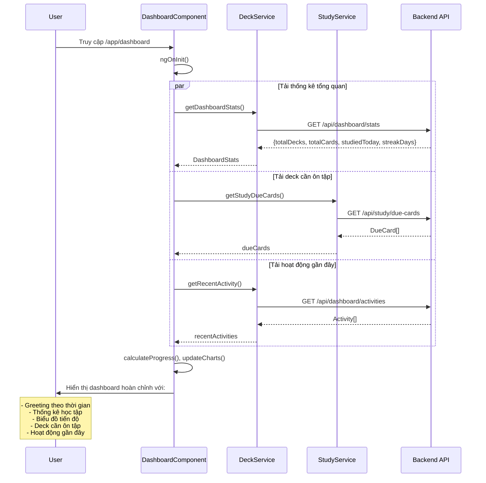
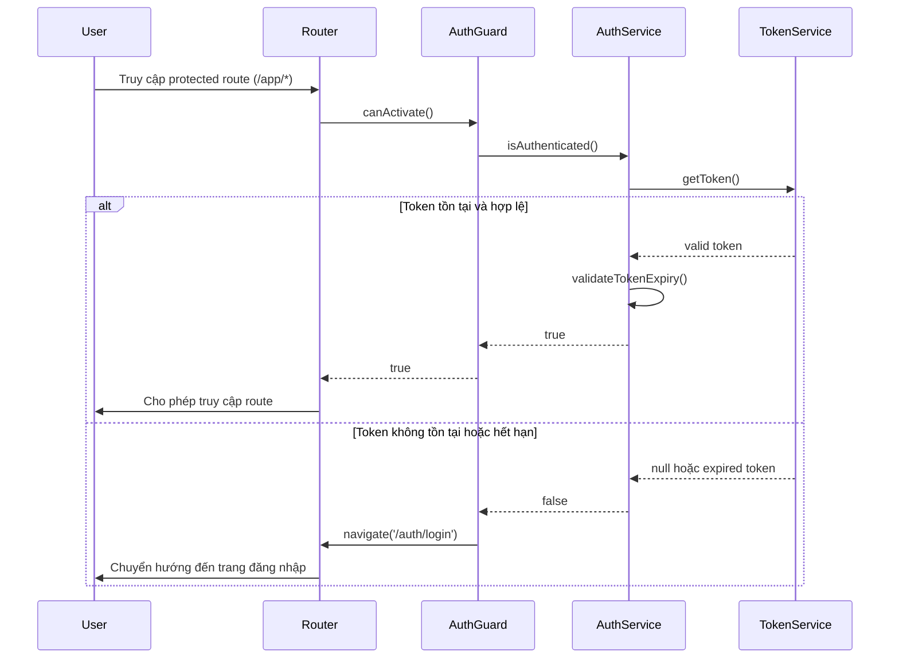

# SEQUENCE DIAGRAMS - ĐỒNG ĐỒ ÁN TỐT NGHIỆP

## 1. UC-01.1: Đăng nhập (Login Sequence)

## 2. UC-01.2: Đăng ký (Register Sequence)

## 3. UC-02: Quản lý Thư viện Deck (Deck Library Management)

## 4. UC-02.1: Tạo Deck mới (Create Deck Detail)

## 5. UC-Dashboard: Hiển thị Dashboard (Dashboard Display)

## 6. Authentication Guard Sequence

## Notes cho Demo:

### Điểm mạnh khi trình bày:
1. **Kiến trúc rõ ràng**: Frontend-Backend separation với RESTful API
2. **Error Handling**: Xử lý lỗi comprehensive cho tất cả scenarios
3. **User Experience**: Loading states, immediate feedback, fallback data
4. **Security**: JWT token authentication với guards
5. **Performance**: Async operations, caching strategies

### Technical Highlights:
- **Angular Standalone Components** (Angular 17+)
- **Reactive Forms** với validation
- **RxJS Observables** cho async operations
- **Ng-Zorro Ant Design** cho UI components
- **Route Guards** cho authentication
- **Service Architecture** cho business logic separation